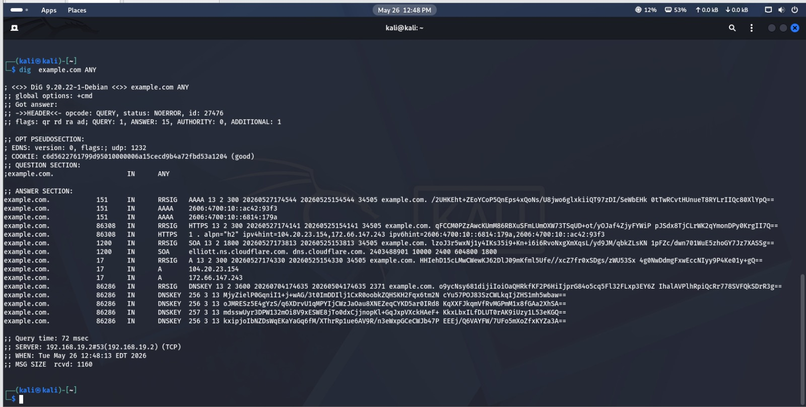
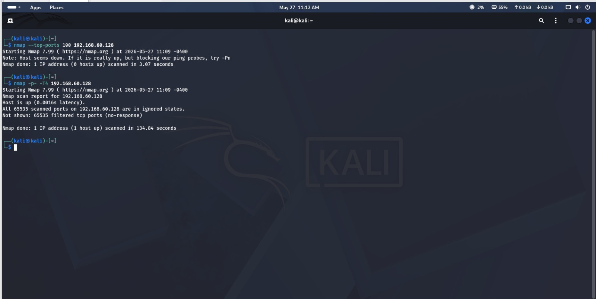
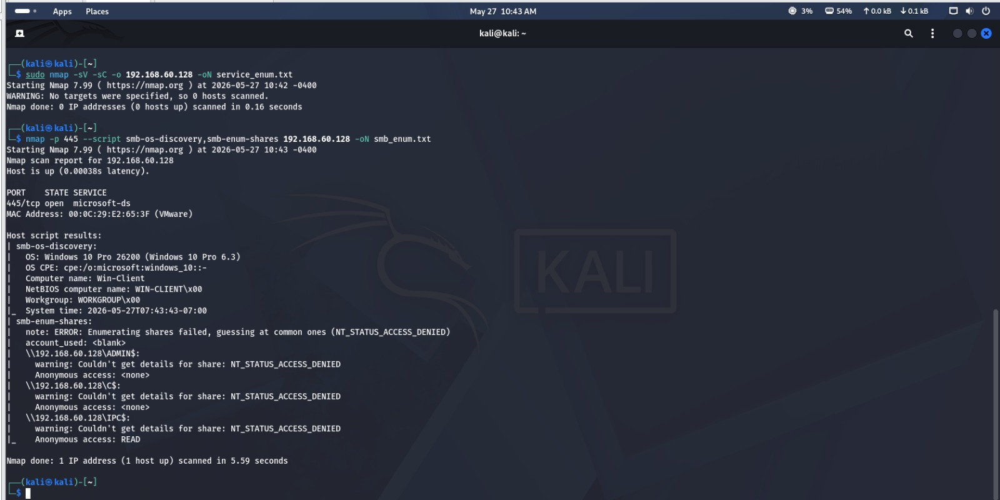
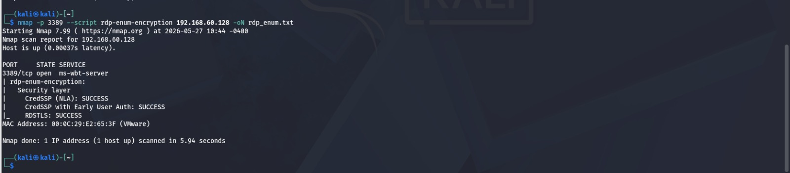
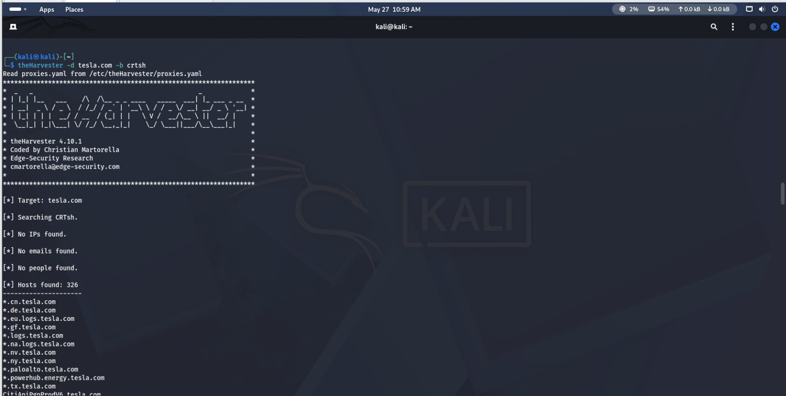
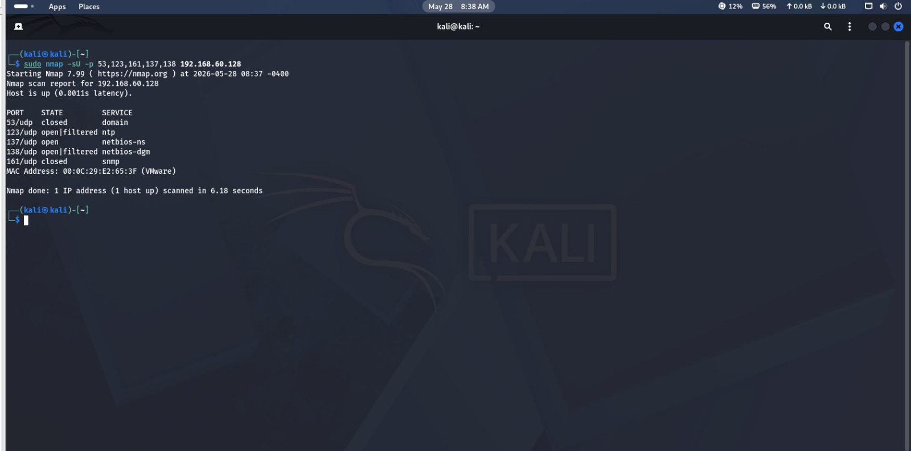
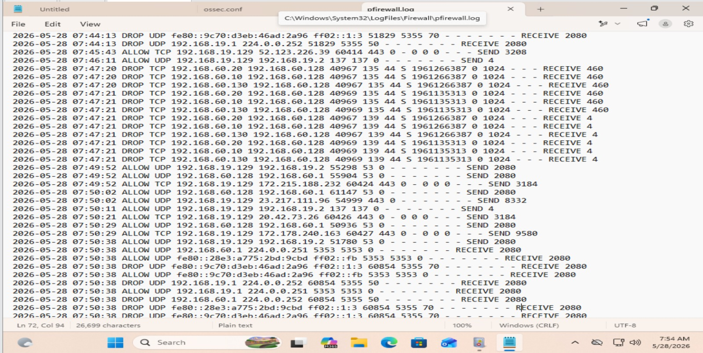
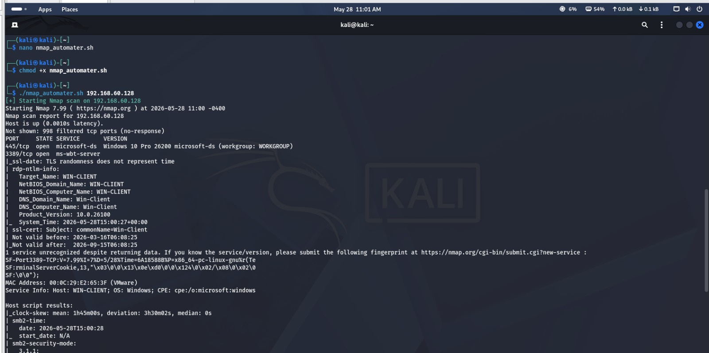
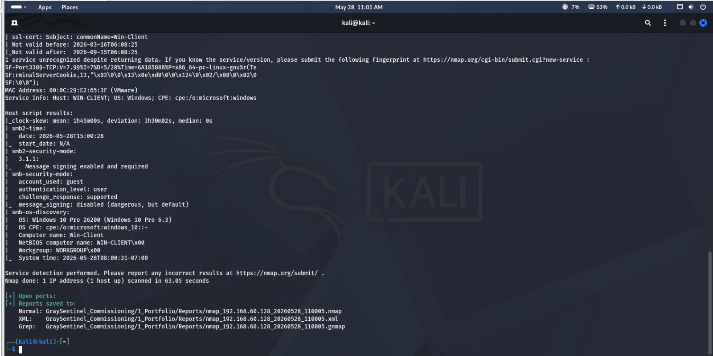

# Reconnaissance Report

**Target:** 192.168.60.128 (Win-Client, lab VM)

**Secondary Domain Recon:** example.com (passive), tesla.com (OSINT)

**Analyst:** Ritesh Gupta

**Date:** 27–28 May 2026

---

## 1. Passive Reconnaissance — DNS

Ran `dig example.com ANY` against example.com to gather public DNS footprint without touching the target directly.

**Findings:**
- Name servers: `elliott.ns.cloudflare.com`, `dns.cloudflare.com` (Cloudflare-hosted DNS)
- A records: `104.20.23.154`, `172.66.147.243`
- AAAA (IPv6) records present: `2606:4700:10::ac42:93f3`, `2606:4700:10::6814:179a`
- HTTPS record advertises ALPN `h2` (HTTP/2 support) with IPv4/IPv6 hints
- DNSKEY records present → domain uses **DNSSEC**
- No MX/TXT (SPF/DKIM) records returned in this query — would need targeted `MX`/`TXT` lookups to confirm mail posture

**Screenshot:**



---

## 2. Active Reconnaissance — Network Mapping

Full port sweep against the lab target.

```
nmap --top-ports 100 192.168.60.128   → host showed as down (ICMP blocked)
nmap -p- -T4 192.168.60.128           → all 65535 ports filtered (no response)
```

**Findings:**
- Host did not respond to ping probes or default top-port scan — ICMP and most TCP probes are being dropped/filtered at the host firewall
- Full port scan (all 65535 ports) took ~135 seconds and returned all ports as `filtered`, confirming a host-based firewall is actively blocking probes rather than the host being offline
- **Takeaway:** default scans without `-Pn` or without touching known-open ports directly (445, 3389) give a false "down" reading — this matters for realistic attack-surface assessment

**Screenshot:**



---

## 3. Service Enumeration

### SMB (port 445)
```
nmap -p 445 --script smb-os-discovery,smb-enum-shares 192.168.60.128
```
| Field | Value |
|---|---|
| OS | Windows 10 Pro 26200 (Windows 10 Pro 6.3) |
| Computer name | WIN-CLIENT |
| Workgroup | WORKGROUP |
| Anonymous access | READ on IPC$ |
| Share enumeration | ADMIN$, C$ denied (NT_STATUS_ACCESS_DENIED) |

**Risk:** Anonymous READ on IPC$ confirms null-session enumeration is possible, a classic recon foothold even though ADMIN$/C$ are locked down.

**Screenshot:**



### RDP (port 3389)
```
nmap -p 3389 --script rdp-enum-encryption 192.168.60.128
```
| Field | Value |
|---|---|
| CredSSP (NLA) | SUCCESS |
| CredSSP + Early User Auth | SUCCESS |
| RDSTLS | SUCCESS |

**Risk:** NLA is enforced (good practice), but RDP is exposed and reachable — a legitimate target for brute-force/credential attacks if not paired with account lockout policies.

**Screenshot:**



---

## 4. OSINT Tool Usage

```
theHarvester -d tesla.com -b crtsh
```
*(Note: ran against `tesla.com` via the crt.sh source — this avoids the Google API key requirement and still demonstrates certificate-transparency-based subdomain harvesting.)*

**Findings:**
- 326 hosts/subdomains discovered via certificate transparency logs
- No emails or people found (crt.sh only surfaces certificate/subdomain data, not personnel)
- Notable subdomains: `*.cn.tesla.com`, `*.de.tesla.com`, `*.logs.tesla.com`, `*.paloalto.tesla.com`

**Attacker value:** 326 subdomains is a large attack surface map — an attacker would triage these for forgotten/staging assets (e.g. internal tooling subdomains like `*.paloalto.tesla.com`) that may be less hardened than the main site.

**Screenshot:**



---

## 5. UDP Scanning

```
sudo nmap -sU -p 53,123,161,137,138 192.168.60.128
```
| Port | State | Service |
|---|---|---|
| 53/udp | closed | domain |
| 123/udp | open\|filtered | ntp |
| 137/udp | **open** | netbios-ns |
| 138/udp | open\|filtered | netbios-dgm |
| 161/udp | closed | snmp |

**Why UDP is slower:** no handshake — closed ports only respond with an ICMP port-unreachable, and no response is ambiguous (open vs. filtered), forcing retransmissions/timeouts.

**Screenshot:**



---

## 6. Evasion Technique — Decoy Scan Detection

Reviewed the Windows Firewall log (`pfirewall.log`) after running a decoy scan.

**Findings:**
- Multiple source IPs (192.168.60.20, .10, .130) logged hitting the same destination ports (135, 139) within the same second, with identical sequence numbers — a clear signature of an Nmap decoy scan (`-D`)
- All entries logged as **DROP**, confirming the host firewall is blocking and logging the probes rather than silently ignoring them

**Defender takeaway:** correlating multiple source IPs hitting identical ports/timestamps is how a decoy scan gets unmasked — a real attacker relying on decoys alone would still leave this pattern behind.

**Screenshot:**



---

## 7. Automated Nmap Scanner

Built and ran `nmap_automator.sh` against 192.168.60.128.

**Output summary:**
- 445/tcp open — microsoft-ds, Windows 10 Pro 26200 (workgroup: WORKGROUP)
- 3389/tcp open — ms-wbt-server (RDP), NTLM info confirms hostname WIN-CLIENT, product version 10.0.26100
- SSL cert on 3389: CN=Win-Client, valid 2026-03-16 → 2026-09-15
- Clock skew detected: ~1h45m mean deviation — worth noting for log correlation during an engagement
- Reports auto-saved in `.nmap`, `.xml`, and `.gnmap` formats to the portfolio Reports directory

**Screenshots:**





---

## Summary — Attack Surface

| Port | Service | Exposure | Risk |
|---|---|---|---|
| 137/udp | netbios-ns | Open | Medium — name service info leak |
| 445/tcp | SMB | Open, anonymous IPC$ read | Medium — null session enumeration |
| 3389/tcp | RDP | Open, NLA enforced | Medium — exposed but hardened |

**Recommended next steps:** disable anonymous IPC$ access, restrict RDP exposure to a jump host/VPN, and confirm SNMP/NTP are intentionally closed rather than firewalled-by-default.
